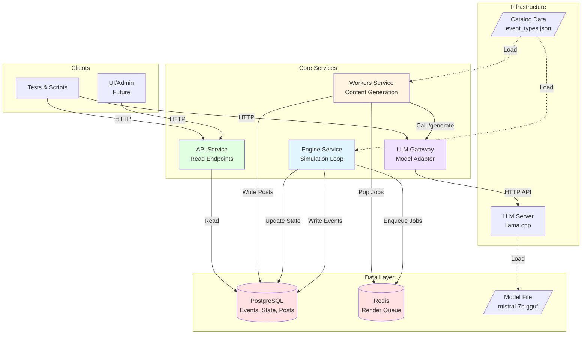
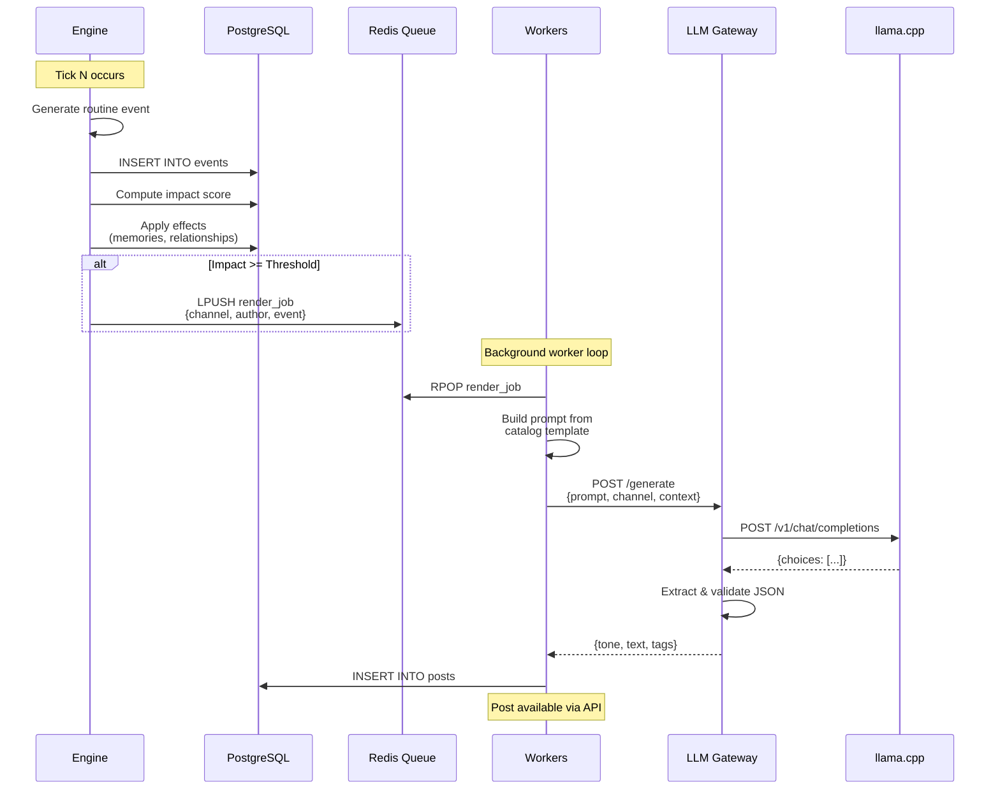
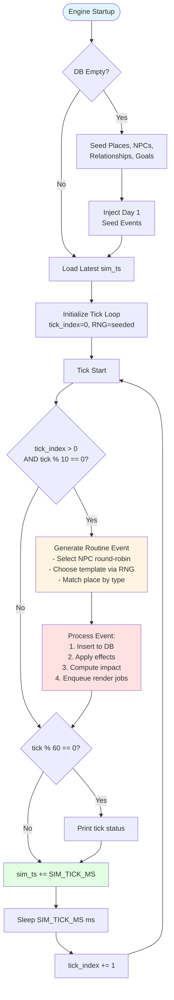
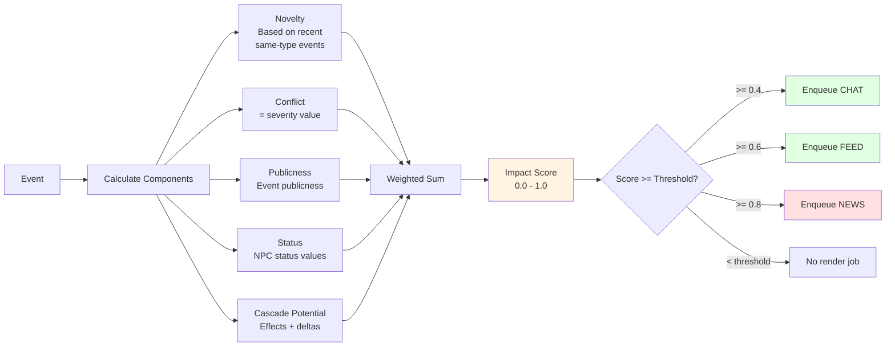
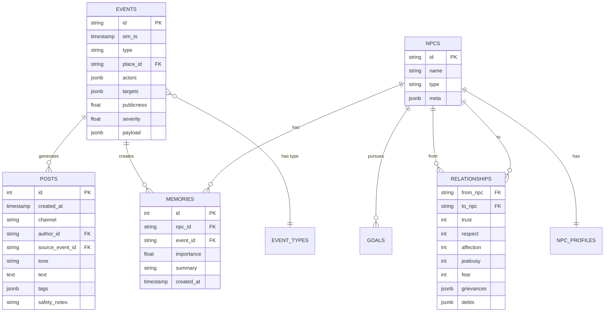

# Koivulahti Architecture (Live)

This repo runs a deterministic village simulation that produces content from events.

## System Architecture

## Services

- **`services/engine`**
  Simulation tick + event injector. Source of truth for `events` and relationship/memory effects. Pushes render jobs to Redis when impact passes thresholds.

- **`services/workers`**
  Consume Redis render jobs, build prompts, call `llm-gateway`, persist to `posts`.

- **`services/llm_gateway`**
  Single adapter boundary for all LLM calls. Enforces strict JSON output and later will implement repair + caching.

- **`services/api`**
  Read API for posts/events + admin stubs.

- **Infrastructure:** Postgres (event store + state tables), Redis (render queue), llama.cpp (LLM server).

## Event Processing Flow

## Simulation Tick Flow

## Impact Scoring System

## Data Models Overview

## Data Flow Details

### 1. Engine Seeding (Startup)

1. Engine checks if DB is empty (no entities exist)
2. If empty, loads from catalog:
   - **Places:** Inserts location entities (sauna, cafe, shop, etc.)
   - **NPCs:** Inserts NPC entities with profiles (persona, values, archetypes)
   - **Relationships:** Initializes relationship edges (trust, respect, affection, etc.)
   - **Goals:** Seeds initial NPC goals (short/long horizon)
3. Injects **Day 1 seed events** from catalog
4. Each event is processed (inserted, effects applied, render jobs enqueued)

### 2. Continuous Simulation (Post-Day 1)

1. **Tick loop** runs every `SIM_TICK_MS` milliseconds (default 1000ms)
2. Every 10 ticks (~10 seconds), **routine event injector** generates:
   - Selects NPC deterministically via round-robin
   - Chooses event template (LOCATION_VISIT, SMALL_TALK, CUSTOMER_INTERACTION) via seeded RNG
   - Matches place by type (sauna/beach, cafe, shop)
3. Event is **processed** (same pipeline as Day 1 events)
4. `sim_ts` advances by `SIM_TICK_MS`

### 3. Event Processing Pipeline

For each event:

1. **Insert:** Write to `events` table with `sim_ts`
2. **Effects:** Apply `event_type.effects`:
   - Create episodic memories for involved NPCs
   - Update relationships (trust, respect, affection, jealousy, fear)
   - Add/remove grievances
3. **Impact:** Calculate impact score (0.0-1.0) using:
   - Novelty (inverse frequency of event type in last 24h)
   - Conflict (= severity)
   - Publicness (event publicness value)
   - Status (average status of involved NPCs)
   - Cascade potential (based on relationship deltas and effects)
4. **Render Jobs:** For each `event_type.render.default_channels`:
   - If `impact >= threshold[channel]`, enqueue to Redis:
     - `{channel, author_id, source_event_id, prompt_context}`

### 4. Content Generation (Workers)

1. **Pop job** from Redis render queue
2. **Load prompt template** from catalog (future: currently using hardcoded prompts)
3. **Build prompt** with event context, NPC profile, and channel requirements
4. **Call LLM Gateway:** `POST /generate`
   - Gateway calls llama.cpp server
   - Validates JSON response
   - Extracts `{tone, text, tags}`
5. **Persist:** Write to `posts` table
6. **Available:** Post is now readable via API `/posts`

### 5. LLM Gateway Responsibilities

- **Single adapter boundary** for all LLM calls
- **Provider abstraction:** Currently supports llama.cpp, designed for vLLM/OpenAI
- **Endpoint fallback:** Tries `/v1/chat/completions` → `/v1/completions` → `/completion`
- **System message merging:** Some models don't support system role, merges into user message
- **JSON extraction:** Uses regex to extract JSON from responses
- **Schema validation:** Ensures response has required fields, provides fallbacks
- **Future:** Caching, repair logic, prompt compression

## Determinism

- All simulation randomness must be seeded via env `SIM_SEED` and logged in events.
- LLM output must not affect truth events; only actions/text derived from events.
- Replay should be possible from `events` + `world_snapshots`.
- RNG is threaded through tick loop to ensure reproducibility.

## Canonical Contracts

Primary runtime source: `packages/shared/data/event_types.json`.
It contains:
- moderation rules + rate limits
- places
- npc profiles + goals + triggers
- relationship initialization
- event types catalog (payload schemas, effects, default render channels)
- prompt templates and Day 1 seed events

Archived specs are in `docs/archive/` for reference only.

## Configuration

Key environment variables (see `koivulahti/infra/.env`):

- **`SIM_SEED`:** Random seed for deterministic simulation (default: 1234)
- **`SIM_TICK_MS`:** Milliseconds per simulation tick (default: 1000)
- **`IMPACT_THRESHOLD_FEED`:** Impact threshold for FEED posts (default: 0.6)
- **`IMPACT_THRESHOLD_CHAT`:** Impact threshold for CHAT posts (default: 0.4)
- **`IMPACT_THRESHOLD_NEWS`:** Impact threshold for NEWS posts (default: 0.8)
- **`LLM_SERVER_URL`:** llama.cpp server URL (e.g., `http://llm-server-cpu:8080`)
- **`LLM_MODEL_PATH`:** Path to GGUF model file in container
- **`DATABASE_URL`:** PostgreSQL connection string
- **`REDIS_URL`:** Redis connection string

